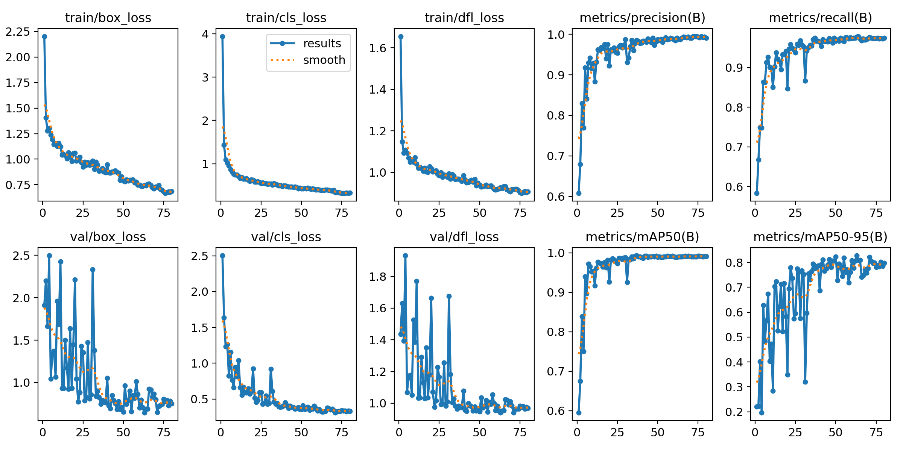
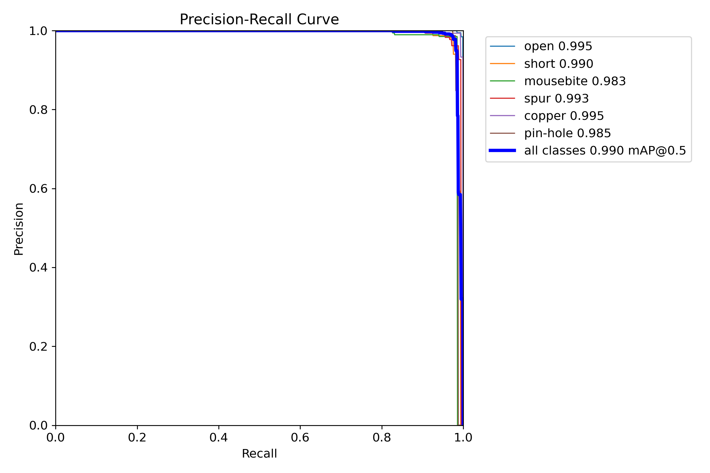
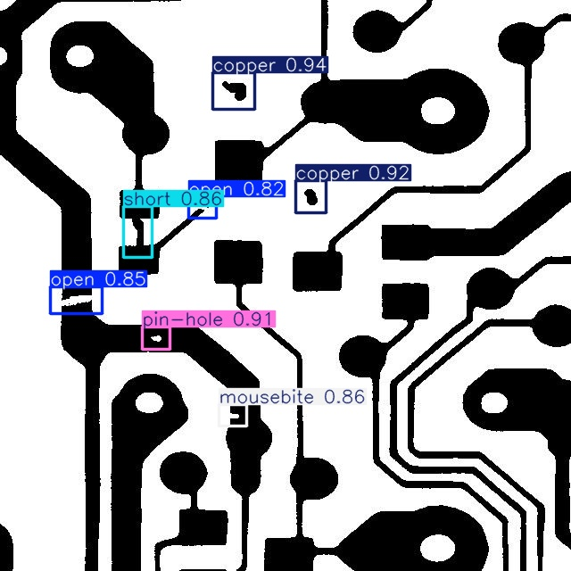
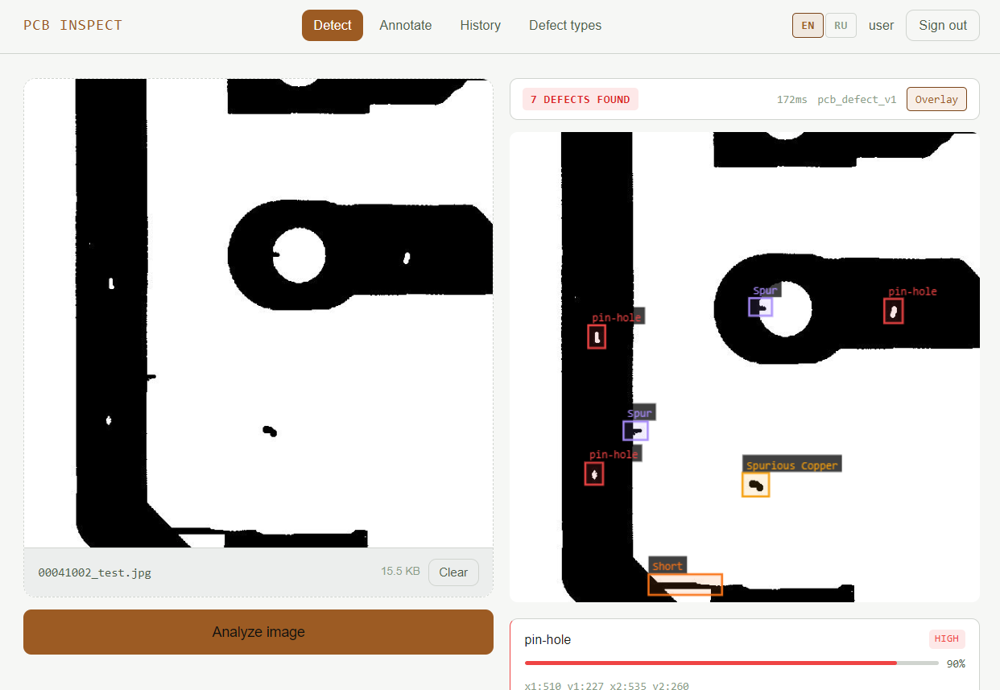

# Детектор дефектов печатных плат

YOLO11s, обученная на [DeepPCB](https://github.com/tangsanli5201/DeepPCB) для обнаружения 6 классов дефектов печатных плат. Модель используется в full-stack веб-приложении с отрисовкой bounding box на стороне клиента.

---

## Метрики модели

| Метрика | Значение |
|---------|----------|
| mAP@50 | 0.993 |
| mAP@50-95 | 0.827 |
| Precision | 0.995 |
| Recall | 0.978 |

YOLO11s · 960×960 · 80 эпох · batch 16 · датасет DeepPCB

**Кривые обучения**



**Кривая Precision-Recall**



---

## Классы дефектов

| ID | Класс           |
|----|-----------------|
| 1 | Pin-hole        |
| 2 | Mouse bite      |
| 3 | Open            |
| 4 | Short circuit   |
| 5 | Spur            |
| 6 | Spurious copper |

---

## Пример обнаружения



---

## Приложение



**Стек:**

- Frontend — Next.js 14 + TypeScript + Tailwind + shadcn/ui
- Backend — FastAPI + SQLAlchemy + ARQ/Redis
- ML — YOLO11s → ONNX, singleton загружается при запуске
- DB — PostgreSQL


### Запуск

```bash
docker-compose up
```

Frontend: `http://localhost:3000`  
API docs: `http://localhost:8000/docs`

---

## Структура каталогов

```
DefectDetectorApp/
├── backend/         # FastAPI-приложение, ML-инференс, ARQ worker
├── frontend/        # Next.js-приложение
├── ml/              # ONNX-модель, скрипты обучения/экспорта
└── docker-compose.yml
```
