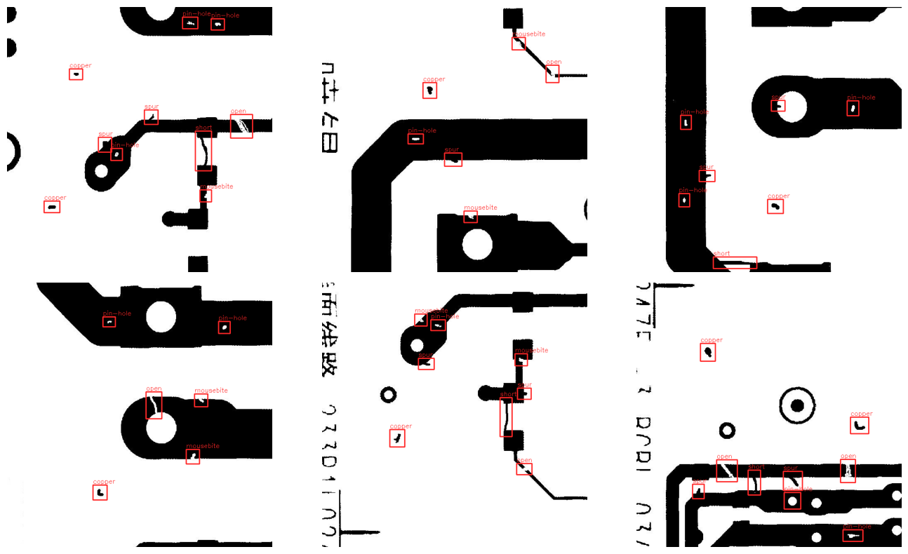

# PCB Defect Detector

YOLO11s trained on [DeepPCB](https://github.com/tangsanli5201/DeepPCB) for 6-class PCB defect detection, served through a full-stack web app with async inference and client-side bbox rendering.

---

## Model Performance

| Metric | Score |
|--------|-------|
| mAP@50 | 0.993 |
| mAP@50-95 | 0.827 |
| Precision | 0.995 |
| Recall | 0.978 |

YOLO11s · 960×960 · 80 epochs · batch 16 · DeepPCB dataset

**Training curves**


**Precision-Recall curve**


---

## Defect Classes

| ID | Class | Severity |
|----|-------|----------|
| 1 | Missing Hole | high |
| 2 | Mouse Bite | medium |
| 3 | Open Circuit | high |
| 4 | Short | critical |
| 5 | Spur | low |
| 6 | Spurious Copper | medium |

---

## Detection Example



---

## App

<!-- add app screenshots here -->

**Stack:**

- Frontend — Next.js 14 + TypeScript + Tailwind + shadcn/ui
- Backend — FastAPI + SQLAlchemy + ARQ/Redis
- ML — YOLO11s → ONNX, singleton loaded at startup
- DB — PostgreSQL

Upload returns a job ID immediately. Frontend polls until complete and draws bounding boxes via canvas — no annotated image stored server-side.

### Run

```bash
docker-compose up
```

Frontend: `http://localhost:3000`  
API docs: `http://localhost:8000/docs`

---

## Directory Structure

```
DefectDetectorApp/
├── backend/         # FastAPI app, ML inference, ARQ worker
├── frontend/        # Next.js app
├── ml/              # ONNX model, training/export scripts
└── docker-compose.yml
```
